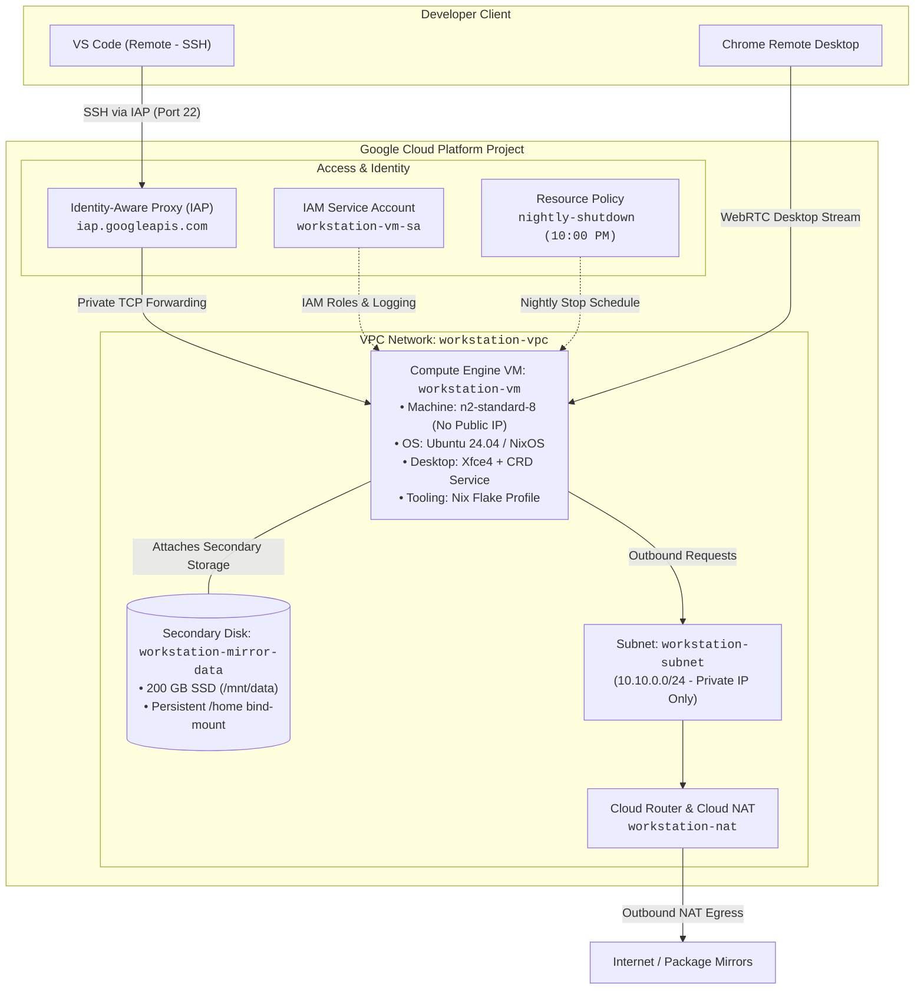

# GCP Workstation Infrastructure

Terraform manifests and automation scripts to provision a secure, private development workstation on Google Cloud Platform.

---

## What This Repo Is

A repeatable Terraform configuration that provisions:
* A private GCP VPC network with Cloud NAT egress.
* A Compute Engine VM (`workstation-vm`) and managed Cloud Workstations.
* A secondary persistent SSD for user data and `/home`.
* A headless desktop environment (Xfce4 + Chrome Remote Desktop).
* A Nix-managed CLI developer toolchain.

---

## How It Works

* **Networking**: Private subnetwork with no external IPs. Inbound traffic uses Identity-Aware Proxy (IAP) tunnels. Outbound traffic routes through Cloud NAT.
* **Persistent Data**: User home (`/home/<user>`) bind-mounts from a dedicated persistent SSD (`/mnt/data`). Data and dotfiles survive OS reinstalls.
* **Tooling**: Base GUI and system packages install via startup scripts. User tools (`gcloud`, `opentofu`, `pack`, `jupyter`, `gemini-cli`) install via a Nix profile flake.
* **Cost Controls**: An automated schedule stops the VM nightly at 10:00 PM.

---

## Architecture



---

## Configuration (`terraform.tfvars`)

Copy `infrastructure/terraform.tfvars.example` to `infrastructure/terraform.tfvars`:

```hcl
project_id              = "your-gcp-project-id"
region                  = "us-central1"
zone                    = "us-central1-a"
machine_type            = "n2-standard-8"
boot_disk_size_gb       = 50
persistent_disk_size_gb = 200
shutdown_timezone       = "America/New_York"
```

### Key Variables

| Variable | Description | Default |
| :--- | :--- | :--- |
| `project_id` | **Required.** GCP project ID. | - |
| `region` | GCP region for resources. | `us-central1` |
| `zone` | GCP zone for the VM. | `us-central1-a` |
| `machine_type` | Compute Engine machine type. | `n2-standard-8` |
| `persistent_disk_size_gb` | Size of persistent data disk (GB). | `200` |
| `shutdown_timezone` | Timezone for nightly VM shutdown. | `America/New_York` |
| `os_flavor` | Boot image flavor: `ubuntu` or `nixos`. | `ubuntu` |

---

## Quickstart

### 1. Authenticate with Google Cloud
```bash
gcloud auth login
gcloud auth application-default login
gcloud config set project YOUR_PROJECT_ID
```

### 2. Deploy Infrastructure
```bash
cd infrastructure
cp terraform.tfvars.example terraform.tfvars
# Update terraform.tfvars with your project ID
terraform init
terraform apply
```

### 3. Bootstrap Developer Tools
Connect to the instance via IAP:
```bash
gcloud compute ssh workstation-vm --zone=us-central1-a --tunnel-through-iap
```
Run the post-create bootstrap script inside the VM:
```bash
/mnt/data/repos/gcp-workstation/scripts/post-create.sh
```

---

## Remote Access via VS Code

Connect to the private VM from your local machine using the VS Code **Remote - SSH** extension.

### 1. Add SSH Configuration
Add this block to `~/.ssh/config` on your local system:

```sshconfig
Host gcp-workstation
    HostName workstation-vm
    User YOUR_USERNAME
    ProxyCommand gcloud compute start-iap-tunnel workstation-vm 22 --listen-on-stdin --zone=us-central1-a --project=YOUR_PROJECT_ID
    IdentityFile ~/.ssh/google_compute_engine
```

### 2. Connect in VS Code
1. Open VS Code locally.
2. Press `F1` (or `Cmd+Shift+P` / `Ctrl+Shift+P`).
3. Select **Remote-SSH: Connect to Host...**
4. Click **`gcp-workstation`**.
5. Open your workspace directory (`/mnt/data/repos`).
